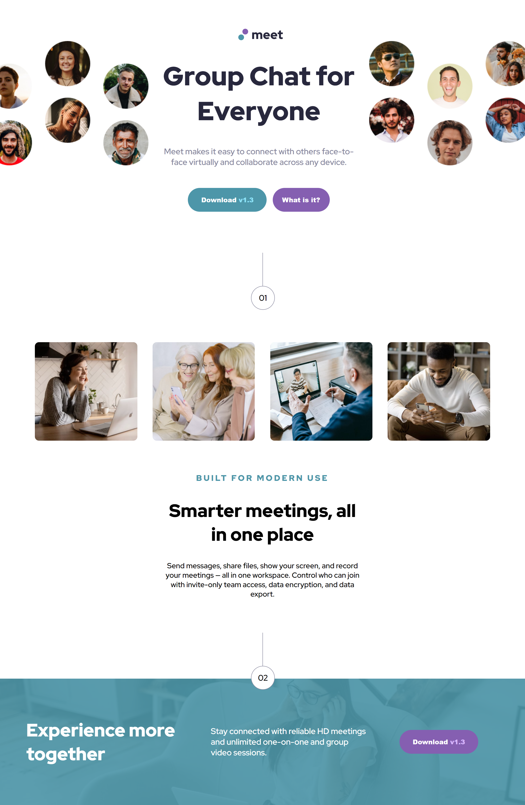
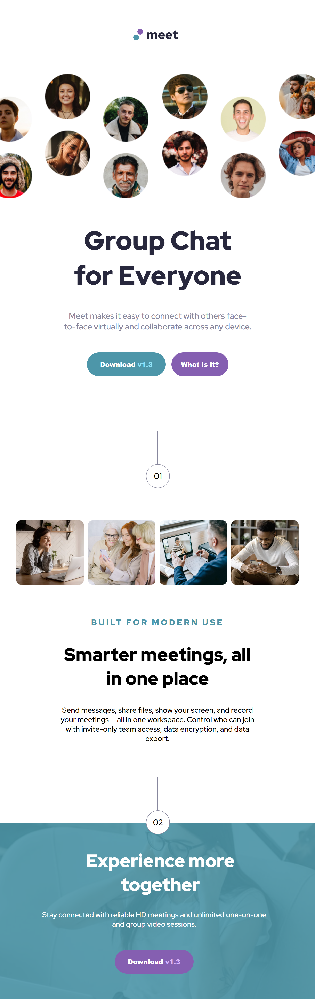

# Training Project: Meet Landing Page

# Project Description

A simple video chat landing page that enables users to

1. View the optimal layout for the site depending on their screen size.
2. See hover states for all interactive elements on the page.

## Live project Link

https://testing-repo-k4uo.vercel.app/

## Tech Stack

HTML and CSS

## Features

1. Users can view page depending on their device's screen size.
2. Button hover effects for desktop view.

# Preview

<table align="center">
    <tr align="center">
        <td>
        
        </td>
    </tr>
    <tr align="center">
        <td>
        
        </td>
        <td>
        
        </td>
    </tr>
</table>

## Lessons learned

1. The importance of 'rem' over 'px'.
2. Effective use of media queries.

- [@benedictarhin-max](https://github.com/benedictarhin-max)| Front-End Developer
